# 📧 Google Services MCP Server

<div align="center">


**Google Gmail, Drive, Calendar를 통합한 MCP (Model Context Protocol) 서버**

[기능](#-주요-기능) • [설치](#-설치) • [사용법](#-사용법) • [API](#-api-문서) • [아키텍처](#-아키텍처)

</div>

---

## 📋 목차

- [개요](#-개요)
- [주요 기능](#-주요-기능)
- [시스템 아키텍처](#-시스템-아키텍처)
- [설치](#-설치)
- [사용법](#-사용법)
- [API 문서](#-api-문서)
- [프로젝트 구조](#-프로젝트-구조)
- [배포](#-배포)

---

## 🎯 개요

이 프로젝트는 Google의 주요 서비스(Gmail, Drive, Calendar)를 하나의 통합 서버로 제공하는 MCP (Model Context Protocol) 서버입니다. LLM 에이전트가 자연어 명령을 통해 이메일 발송, 파일 업로드, 일정 관리 등을 수행할 수 있도록 지원합니다.

### 🎨 전체 시스템 개요

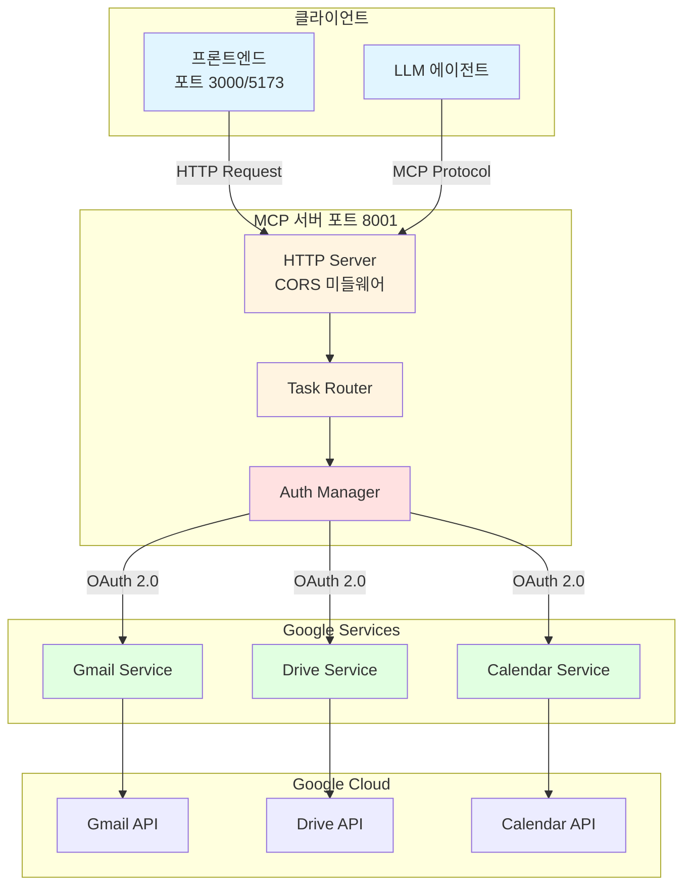

---

## 🚀 주요 기능

### 📧 Gmail 서비스

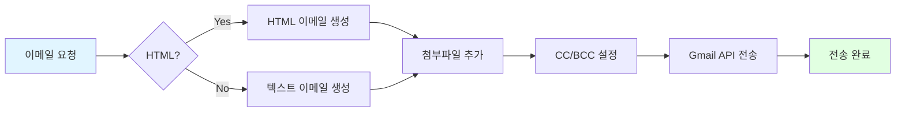

**기능 목록:**
- ✉️ 이메일 발송 (텍스트/HTML)
- 📎 첨부파일 지원
- 👥 참조(CC), 숨은참조(BCC)
- 🔄 배치 전송

### 📁 Google Drive 서비스

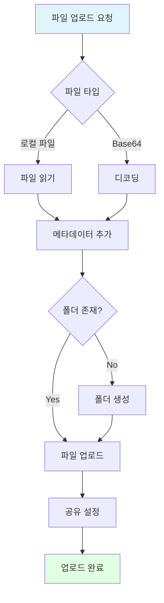

**기능 목록:**
- 📤 파일 업로드
- 📂 계약서 전용 폴더 관리
- 🔗 파일 공유 링크 생성
- 🏷️ 메타데이터 관리 (계약일, 당사자 등)
- 🔍 파일 검색

### 📅 Google Calendar 서비스

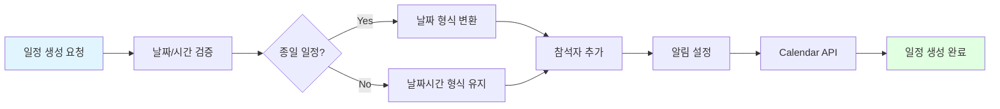

**기능 목록:**
- 📆 일정 생성
- 🤝 회의 일정 관리
- ⏰ 알림 설정 (분 단위)
- 👥 참석자 초대
- 🌍 타임존 지원

---

## 🏗️ 시스템 아키텍처

### 요청 처리 흐름

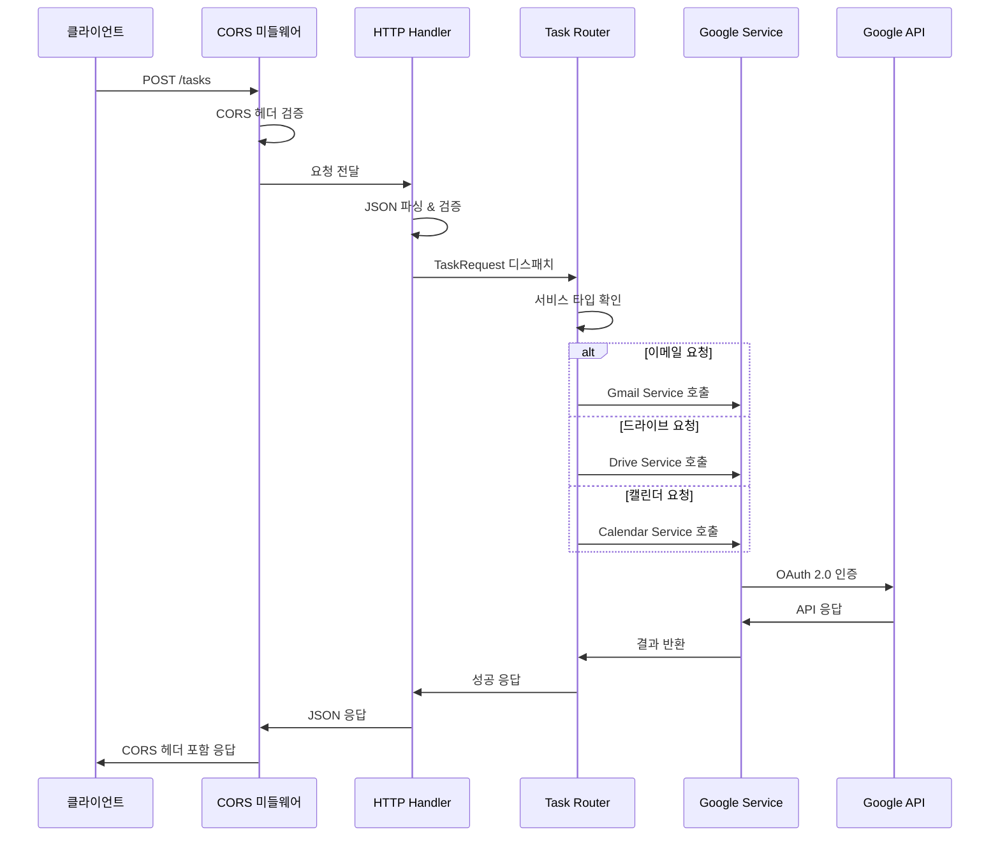

### OAuth 2.0 인증 플로우

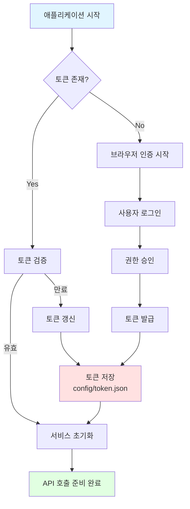

---

## 💻 설치

### 1️⃣ 사전 요구사항

- Python 3.9 이상
- Google Cloud 프로젝트
- OAuth 2.0 클라이언트 인증 정보

### 2️⃣ 의존성 설치

```bash
# 저장소 클론
git clone <repository-url>
cd java_2nd_project_mcp

# 가상환경 생성 (선택사항)
python -m venv venv
source venv/bin/activate  # Windows: venv\Scripts\activate

# 의존성 설치
pip install -r requirements.txt
```

### 3️⃣ Google Cloud 설정

#### 📋 단계별 가이드

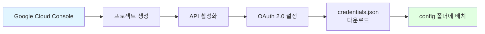

1. **Google Cloud Console 접속**
   - [console.cloud.google.com](https://console.cloud.google.com/) 방문
   - 새 프로젝트 생성 또는 기존 프로젝트 선택

2. **API 활성화**
   - API 및 서비스 > 라이브러리
   - 다음 API들을 검색하여 활성화:
     - ✅ Gmail API
     - ✅ Google Drive API
     - ✅ Google Calendar API

3. **OAuth 2.0 클라이언트 ID 생성**
   - API 및 서비스 > 사용자 인증 정보
   - "사용자 인증 정보 만들기" > "OAuth 클라이언트 ID"
   - 애플리케이션 유형: **데스크톱 앱**
   - `credentials.json` 다운로드

4. **인증 정보 배치**
   ```bash
   mkdir -p config
   mv ~/Downloads/credentials.json config/
   ```

### 4️⃣ 환경 변수 설정

`.env` 파일 생성:

```env
# Google OAuth Credentials
GOOGLE_CLIENT_ID=your_client_id_here
GOOGLE_CLIENT_PASSWORD=your_client_secret_here
GOOGLE_REDIRECT_URI=http://localhost:3000/auth/google/callback

# Server Configuration
PORT=8080
HOST=localhost
MCP_HTTP_PORT=8001
```

---

## 🎮 사용법

### 🔧 서버 실행

#### MCP 서버 모드

```bash
python -m src.mcp_server
```

#### HTTP 서버 모드 (권장)

```bash
python -m src.http_server
# 또는
python src/http_server.py
```

서버가 정상적으로 실행되면:
```
======== Running on http://0.0.0.0:8001 ========
(Press CTRL+C to quit)
```

### 🌐 HTTP API 사용

#### Health Check

```bash
curl http://localhost:8001/health
```

응답:
```json
{
  "status": "ok"
}
```

---

## 📚 API 문서

### 엔드포인트 개요

| 메서드 | 경로 | 설명 |
|--------|------|------|
| POST | `/tasks` | 작업 요청 (이메일/드라이브/캘린더) |
| GET | `/health` | 서버 상태 확인 |

### 📮 POST /tasks

#### 요청 구조

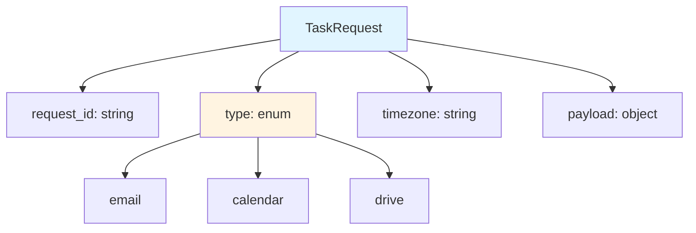

#### 공통 요청 형식

```json
{
  "request_id": "req-123",
  "type": "email | calendar | drive",
  "timezone": "Asia/Seoul",
  "payload": {
    // 타입별 페이로드
  }
}
```

---

### 📧 이메일 발송

#### 요청 예시

```bash
curl -X POST http://localhost:8001/tasks \
  -H "Content-Type: application/json" \
  -d '{
    "type": "email",
    "payload": {
      "to": "recipient@example.com",
      "subject": "안녕하세요",
      "body": "이메일 본문 내용입니다.",
      "cc": ["cc@example.com"],
      "bcc": ["bcc@example.com"],
      "html": false,
      "attachments": ["/path/to/file.pdf"]
    }
  }'
```

#### Payload 필드

| 필드 | 타입 | 필수 | 설명 |
|------|------|------|------|
| `to` | string | ✅ | 수신자 이메일 |
| `subject` | string | ✅ | 이메일 제목 |
| `body` | string | ✅ | 이메일 본문 |
| `cc` | array | ❌ | 참조 이메일 목록 |
| `bcc` | array | ❌ | 숨은참조 이메일 목록 |
| `html` | boolean | ❌ | HTML 형식 사용 여부 |
| `attachments` | array | ❌ | 첨부파일 경로 목록 |

#### 응답 예시

```json
{
  "success": true,
  "request_id": "req-123",
  "type": "email",
  "result": {
    "success": true,
    "message_id": "18c5f9a1b2c3d4e5",
    "thread_id": "18c5f9a1b2c3d4e5",
    "to": ["recipient@example.com"]
  }
}
```

---

### 📅 캘린더 일정 생성

#### 요청 예시

```bash
curl -X POST http://localhost:8001/tasks \
  -H "Content-Type: application/json" \
  -d '{
    "type": "calendar",
    "timezone": "Asia/Seoul",
    "payload": {
      "summary": "팀 회의",
      "start_time": "2024-12-10T14:00:00",
      "end_time": "2024-12-10T15:00:00",
      "description": "프로젝트 진행 상황 논의",
      "location": "회의실 A",
      "attendees": ["member1@example.com", "member2@example.com"],
      "reminders": [10, 30],
      "all_day": false
    }
  }'
```

#### Payload 필드

| 필드 | 타입 | 필수 | 설명 |
|------|------|------|------|
| `summary` | string | ✅ | 일정 제목 |
| `start_time` | string | ✅ | 시작 시간 (ISO 8601) |
| `end_time` | string | ✅ | 종료 시간 (ISO 8601) |
| `description` | string | ❌ | 일정 설명 |
| `location` | string | ❌ | 장소 |
| `attendees` | array | ❌ | 참석자 이메일 목록 |
| `reminders` | array | ❌ | 알림 시간 (분 단위) |
| `all_day` | boolean | ❌ | 종일 일정 여부 |

#### 응답 예시

```json
{
  "success": true,
  "request_id": "req-456",
  "type": "calendar",
  "result": {
    "success": true,
    "event_id": "abc123def456",
    "summary": "팀 회의",
    "start": {
      "dateTime": "2024-12-10T14:00:00+09:00",
      "timeZone": "Asia/Seoul"
    },
    "end": {
      "dateTime": "2024-12-10T15:00:00+09:00",
      "timeZone": "Asia/Seoul"
    },
    "html_link": "https://calendar.google.com/event?eid=..."
  }
}
```

---

### 📁 드라이브 파일 업로드

#### 요청 예시 (로컬 파일)

```bash
curl -X POST http://localhost:8001/tasks \
  -H "Content-Type: application/json" \
  -d '{
    "type": "drive",
    "payload": {
      "file_path": "/path/to/contract.pdf",
      "contract_name": "2024년 서비스 계약서",
      "contract_date": "2024-12-01",
      "parties": ["회사A", "회사B"],
      "folder_name": "Contracts"
    }
  }'
```

#### 요청 예시 (Base64)

```bash
curl -X POST http://localhost:8001/tasks \
  -H "Content-Type: application/json" \
  -d '{
    "type": "drive",
    "payload": {
      "file_content_b64": "JVBERi0xLjQKJeLjz9...",
      "file_name": "contract.pdf",
      "contract_name": "2024년 서비스 계약서",
      "contract_date": "2024-12-01",
      "parties": ["회사A", "회사B"],
      "folder_name": "Contracts"
    }
  }'
```

#### Payload 필드

| 필드 | 타입 | 필수 | 설명 |
|------|------|------|------|
| `contract_name` | string | ✅ | 계약서 이름 |
| `file_path` | string | * | 로컬 파일 경로 |
| `file_content_b64` | string | * | Base64 인코딩된 파일 |
| `file_name` | string | ❌ | 파일 이름 (Base64 사용 시) |
| `contract_date` | string | ❌ | 계약 날짜 |
| `parties` | array | ❌ | 계약 당사자 목록 |
| `folder_name` | string | ❌ | 폴더 이름 (기본: Contracts) |

> **참고:** `file_path`와 `file_content_b64` 중 하나는 필수입니다.

#### 응답 예시

```json
{
  "success": true,
  "request_id": "req-789",
  "type": "drive",
  "result": {
    "success": true,
    "file_id": "1a2b3c4d5e6f7g8h9i",
    "file_name": "2024년 서비스 계약서.pdf",
    "web_view_link": "https://drive.google.com/file/d/.../view",
    "web_content_link": "https://drive.google.com/uc?id=...",
    "folder_id": "0BxYz1A2B3C4D5E6F7G"
  }
}
```

---

### ❌ 에러 응답

#### 검증 오류

```json
{
  "success": false,
  "error": "validation_error",
  "details": [
    {
      "loc": ["payload", "to"],
      "msg": "field required",
      "type": "value_error.missing"
    }
  ]
}
```

#### 서버 오류

```json
{
  "success": false,
  "request_id": "req-123",
  "type": "email",
  "error": "Failed to send email: Invalid credentials"
}
```

---

## 📂 프로젝트 구조

```
java_2nd_project_mcp/
│
├── 📁 src/                          # 소스 코드
│   ├── 📁 google_services/          # Google 서비스 도메인
│   │   ├── __init__.py
│   │   ├── 📧 gmail_service.py      # Gmail 서비스
│   │   ├── 📁 drive_service.py      # Drive 서비스
│   │   └── 📅 calendar_service.py   # Calendar 서비스
│   │
│   ├── __init__.py
│   ├── 🔐 auth.py                   # OAuth 인증 관리
│   ├── ⚙️ config.py                 # 설정 관리
│   ├── 🎯 mcp_server.py            # MCP 서버 (MCP 프로토콜)
│   └── 🌐 http_server.py           # HTTP 서버 (REST API)
│
├── 📁 config/                       # 설정 파일
│   ├── 🔑 credentials.json         # OAuth 인증 정보 (직접 배치)
│   └── 🎫 token.json               # 액세스 토큰 (자동 생성)
│
├── 📁 java_2nd_project_server/     # 프론트엔드 연동 서버
│
├── 📄 requirements.txt              # Python 의존성
├── 📄 .env                          # 환경 변수
├── 📄 .dockerignore                 # Docker 제외 파일
├── 🐳 Dockerfile                    # Docker 이미지 정의
├── 🐳 docker-compose.yml           # Docker Compose 설정
└── 📖 README.md                     # 프로젝트 문서
```

### 코어 모듈 설명

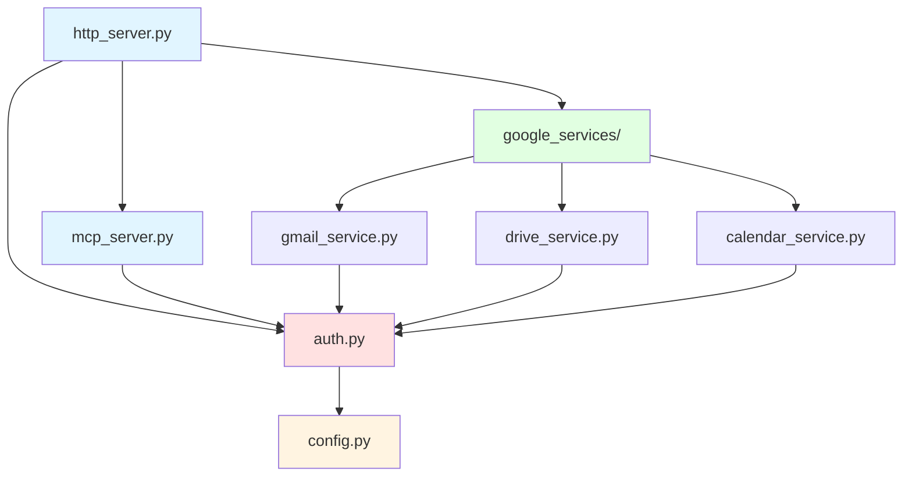

| 모듈 | 역할 |
|------|------|
| `http_server.py` | HTTP API 엔드포인트 제공, CORS 처리 |
| `mcp_server.py` | MCP 프로토콜 통신 |
| `auth.py` | Google OAuth 2.0 인증 관리 |
| `config.py` | 환경 설정 관리 |
| `gmail_service.py` | Gmail API 래퍼 |
| `drive_service.py` | Drive API 래퍼 |
| `calendar_service.py` | Calendar API 래퍼 |

---

## 🐳 배포

### Docker로 실행

#### 1. 이미지 빌드

```bash
docker build -t google-services-mcp .
```

#### 2. 컨테이너 실행

```bash
docker run --rm -it \
  -p 8001:8001 \
  --env-file .env \
  -v "$(pwd)/config:/app/config" \
  google-services-mcp
```

#### 3. Docker Compose 사용

```bash
# 백그라운드 실행
docker-compose up -d

# 로그 확인
docker-compose logs -f

# 중지
docker-compose down
```

### 프로덕션 배포 체크리스트

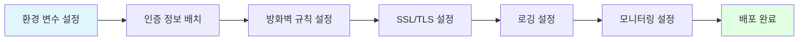

- [ ] 환경 변수 `.env` 설정 완료
- [ ] `config/credentials.json` 배치
- [ ] 방화벽에서 8001 포트 허용
- [ ] HTTPS 리버스 프록시 설정 (nginx/caddy)
- [ ] 로그 로테이션 설정
- [ ] 모니터링 도구 연동 (Prometheus/Grafana)

---

## 🔒 보안

### 보안 모범 사례

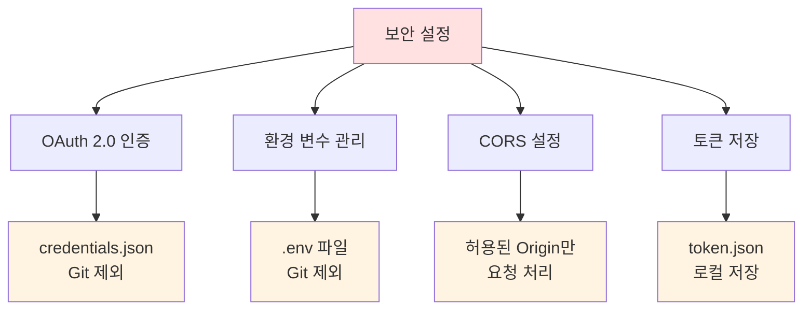

- ✅ OAuth 2.0 인증 사용
- ✅ 토큰은 로컬에 안전하게 저장 (`config/token.json`)
- ✅ `.env`와 `credentials.json`은 `.gitignore`에 추가
- ✅ CORS 미들웨어로 허용된 Origin만 접근 가능
- ✅ 환경 변수로 민감한 정보 관리

### .gitignore 필수 항목

```gitignore
# 환경 설정
.env
.env.local

# Google 인증 정보
config/credentials.json
config/token.json

# Python
__pycache__/
*.py[cod]
venv/
```

---

## 🔧 개발

### 개발 환경 설정

```bash
# 개발 의존성 설치
pip install -r requirements.txt

# 코드 포맷팅
black src/

# 린팅
flake8 src/

# 타입 체킹
mypy src/
```

### 디버깅

로그 레벨 설정:

```python
import logging
logging.basicConfig(level=logging.DEBUG)
```

---

## 🤝 기여

기여를 환영합니다! 다음 단계를 따라주세요:

1. Fork the repository
2. Create your feature branch (`git checkout -b feature/AmazingFeature`)
3. Commit your changes (`git commit -m 'Add some AmazingFeature'`)
4. Push to the branch (`git push origin feature/AmazingFeature`)
5. Open a Pull Request

---

## 📄 라이선스

이 프로젝트는 MIT 라이선스 하에 배포됩니다.

---

## 📞 문의

프로젝트 관련 문의사항이나 버그 리포트는 이슈를 생성해주세요.

---

<div align="center">

**Made with ❤️ by Java 2nd Project Team**

⭐ 이 프로젝트가 도움이 되었다면 Star를 눌러주세요!

</div>